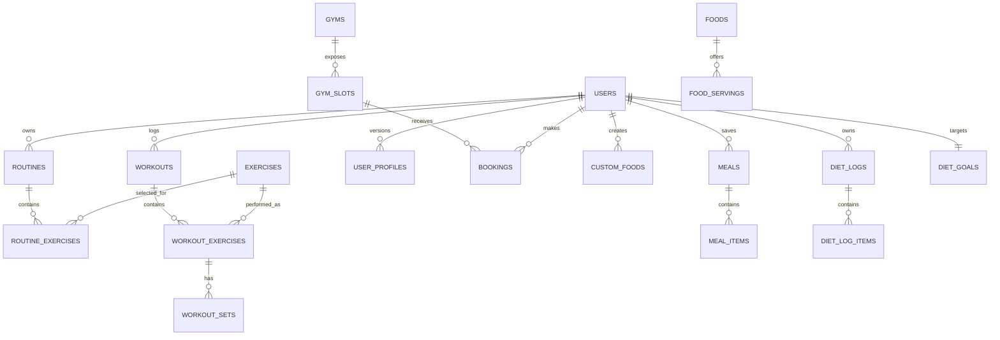

# LiftLog

LiftLog is a full-stack fitness companion for planning and recording strength workouts, tracking nutrition, booking gym slots, building a personal fitness profile, and receiving contextual guidance from an AI coach.

The repository contains an Angular single-page application (`FE`) and a FastAPI/SQLAlchemy REST API (`BE`). The application is designed so that user-owned records are identified from the bearer token rather than accepting a `user_id` from the client.

## Contents

- [What it does](#what-it-does)
- [Technology](#technology)
- [Repository layout](#repository-layout)
- [Run locally](#run-locally)
- [Configuration](#configuration)
- [Application areas](#application-areas)
- [API overview](#api-overview)
- [Data model](#data-model)
- [Seed and import data](#seed-and-import-data)
- [Testing and development](#testing-and-development)
- [Operational notes](#operational-notes)

## What it does

LiftLog currently provides:

- Email/password sign-up, login, JWT access/refresh tokens, and automatic client-side token refresh.
- Versioned onboarding and profile data covering physical information, lifestyle, training preferences, nutrition preferences, and goals.
- Reusable workout routines, an exercise catalogue, completed workout recording, workout history, and exercise set/history queries.
- Gym discovery by location, gym details, dated time slots, bookings, and booking cancellation.
- A nutrition log with system foods and servings, user-created foods, reusable meals, daily nutrient totals, historical views, and calorie/macro goals.
- An authenticated AI coach endpoint that supplies Gemini with a bounded snapshot of the user's routines, recent workouts, latest profile, diet logs, weight changes, and diet goals.

## Technology

| Layer | Implementation |
| --- | --- |
| Frontend | Angular 21, TypeScript, RxJS, standalone components and Angular Router |
| Backend | Python, FastAPI, Uvicorn, Pydantic v2 |
| Persistence | SQLAlchemy 2; SQLite by default, configurable with `DATABASE_URL` |
| Authentication | Password hashing with PBKDF2-HMAC-SHA256 and signed JWT access/refresh tokens |
| AI coach | Google Gen AI SDK / Gemini |
| Data imports | `openpyxl` for gym sheets; native XLSX/XML parsing for food sheets |
| Tests | Pytest and FastAPI `TestClient`; Angular/Vitest test configuration |

## Repository layout

```text
LiftLog/
├── BE/                         # FastAPI backend
│   ├── app/
│   │   ├── api/routes/         # Auth, workouts, diet, gyms, profile, coach routes
│   │   ├── core/config.py      # Environment configuration and production checks
│   │   ├── services/ai_coach.py
│   │   ├── utils/              # Exercise and food loaders
│   │   ├── db.py               # Engine, sessions, initialization, lightweight migrations
│   │   ├── models.py           # SQLAlchemy schema
│   │   └── schemas.py          # Request/response models
│   ├── Documents/Database/     # Mermaid ER diagram and rendered schema image
│   ├── scripts/                # Food and gym spreadsheet importers
│   ├── tests/
│   └── .env.production.example
├── FE/                         # Angular frontend
│   ├── public/gyms/            # Local gym imagery
│   └── src/app/
│       ├── core/               # Auth service, route guard, auth interceptor
│       ├── pages/              # Product pages
│       ├── services/           # REST clients
│       └── shared/             # Reusable dialog
├── project_context.txt         # Historical project and schema context
└── README.md
```

## Run locally

### Prerequisites

- Python 3.10 or later
- Node.js and npm compatible with Angular 21
- A Gemini API key only if you want the AI coach endpoint to return responses

### 1. Configure the backend

From the repository root:

```bash
cd /Users/snehasishdutta/Desktop/LiftLog/LiftLog
python3 -m venv .venv
source .venv/bin/activate
python3 -m pip install -r BE/requirements.txt
```

Create `BE/.env` for local development (the committed `.env.production.example` is a reference for the complete production configuration):

```dotenv
APP_ENV=development
DATABASE_URL=sqlite:///./liftlog.db
JWT_SECRET_KEY=replace-with-a-long-unique-local-secret
CORS_ORIGINS=http://localhost:4200
SEED_DEMO_DATA=true
# GEMINI_API_KEY=your-key-here
```

Use a unique `JWT_SECRET_KEY` and set `GEMINI_API_KEY` to enable the coach. With the SQLite URL above, launching the API from the repository root creates/uses `liftlog.db` there.

Start the API:

```bash
uvicorn BE.app.main:app --reload --port 8001
```

On startup, the API creates any missing tables and applies its built-in compatibility migrations. In non-production environments it also seeds a demo account and the exercise catalogue when `SEED_DEMO_DATA=true`.

Useful local endpoints:

- Health check: `http://localhost:8001/health`
- Interactive API documentation: `http://localhost:8001/docs`
- OpenAPI document: `http://localhost:8001/openapi.json`

### 2. Start the frontend

In a second terminal:

```bash
cd /Users/snehasishdutta/Desktop/LiftLog/LiftLog/FE
npm ci
npm start
```

Open `http://localhost:4200`. Both Angular environment files currently target `http://localhost:8001/api/v1`; change `FE/src/environments/environment*.ts` if the API runs elsewhere.

## Configuration

The backend reads `BE/.env`. `BE/.env.production.example` lists the supported values:

| Variable | Purpose |
| --- | --- |
| `APP_ENV` | `development`, `test`, or `production` |
| `APP_NAME` | API display name |
| `DATABASE_URL` | SQLAlchemy database URL; SQLite is the default |
| `API_PREFIX` | API namespace, default `/api/v1` |
| `JWT_SECRET_KEY`, `JWT_ALGORITHM` | JWT signing configuration |
| `ACCESS_TOKEN_EXPIRE_MINUTES` | Access-token lifetime; default 15 minutes |
| `REFRESH_TOKEN_EXPIRE_DAYS` | Refresh-token lifetime; default 30 days |
| `CORS_ORIGINS` | Comma-separated allowed frontend origins |
| `SEED_DEMO_DATA` | Enables startup demo/exercise seeding outside production |
| `LOG_LEVEL`, `LOG_TO_FILE`, `UVICORN_ACCESS_LOG` | Logging controls |
| `GEMINI_API_KEY`, `GEMINI_MODEL` | AI coach provider configuration |

Production startup rejects weak/default JWT secrets, wildcard CORS, and non-HTTPS CORS origins. Keep `.env`, the SQLite database, logs, virtual environments, and temporary source spreadsheets out of version control; the supplied ignore files already do this.

## Application areas

### Authentication and session handling

`POST /auth/signup` creates an email/password account. `POST /auth/login` validates it and issues both tokens; `POST /auth/refresh` rotates them. The Angular `AuthService` persists session data in local storage, proactively refreshes access tokens, and the HTTP interceptor retries a request once after a `401` using the refresh token.

All protected API requests use:

```http
Authorization: Bearer <access_token>
```

The backend decodes the token, loads the user, and checks that the presented token is still the currently issued token stored for that user. This makes a later login/refresh invalidate an earlier access token for that account.

### Profile and onboarding

The onboarding and profile pages capture physical data, habits, training history/preferences, dietary preferences, and goals. A profile submission creates a new version rather than mutating the prior row. The API can return the latest profile or its version history, which also gives the coach a recent weight-change signal.

### Workouts

Users can manage routines made of ordered exercises and target set counts. A completed workout submission records its timestamps, optional routine, ordered exercises, and set-level weight/repetition data in one transaction. Workout history is paginated; exercise routes provide best/top sets and prior performance history for the signed-in user.

### Nutrition

System foods store nutrition per 100 g and optional familiar servings. Users can add their own foods, assemble reusable meals, and create or replace one daily diet log containing meal groups and food quantities. Nutrient values are calculated from the referenced food/custom-food and quantity, then persisted as snapshots in log items so historical entries survive future food edits or soft deletion. Goals are one row per user and daily summaries include consumed, target, remaining, and meal-level totals.

### Gyms and bookings

The gym experience supports nearby-gym lookup from latitude/longitude, details and facilities, dated slots, booking creation, a user's booking list/detail, and cancellation. Slot availability is based on the gym's configured maximum bookings per slot; cancelled bookings no longer count as active occupancy.

### AI coach

`POST /ai/coach/chat` accepts a page identifier, optional conversation context, and a message. The server constructs the prompt from a checked-in template plus only the authenticated user's data: routines, up to 30 recent workouts, latest profile, 30 days of diet/weight history, and diet targets. It uses Gemini with constrained generation settings and returns `503` if no API key is configured.

## API overview

All paths below are relative to `/api/v1`. Except sign-up, login, refresh, health, and public gym reads, endpoints require a bearer token. FastAPI's `/docs` is the definitive request/response reference.

| Area | Endpoints |
| --- | --- |
| Auth | `POST /auth/signup`, `POST /auth/login`, `POST /auth/refresh` |
| Profile | `GET /profile`, `GET /profile/history`, `POST /profile` |
| Exercises | `GET /exercises`, `GET /exercises/{exercise_id}/top-sets`, `GET /exercises/{exercise_id}/history` |
| Routines | `GET/POST /routines`, `GET/PUT/DELETE /routines/{routine_id}` |
| Workouts | `POST /workouts`, `GET /workouts?limit=&offset=` |
| Food catalogue | `GET /diet/foods`, `GET /diet/foods/{food_id}` |
| Custom foods | `POST/GET /diet/custom-foods`, `PATCH/DELETE /diet/custom-foods/{custom_food_id}` |
| Saved meals | `POST/GET /diet/meals`, `PATCH/DELETE /diet/meals/{meal_id}` |
| Diet logs | `POST/GET /diet/logs`, `PATCH/DELETE /diet/logs/{log_id}` |
| Nutrition reporting | `GET /diet/summary`, `GET /diet/history`, `GET/PUT /diet/goals` |
| Gyms | `GET /gyms/nearby`, `GET /gyms/{gym_id}`, `GET /gyms/{gym_id}/details`, `GET /gyms/{gym_id}/slots`, `GET /gyms/{gym_id}/slots/{slot_id}` |
| Bookings | `POST/GET /bookings`, `GET/DELETE /bookings/{booking_id}` |
| AI coach | `POST /ai/coach/chat` |

Selected query parameters include `search`, `category`, `page`, and `page_size` for foods; `date` for daily diet reads/summaries; `start_date`/`end_date` for diet history; `limit`/`offset` for workout history; and `lat`/`lng` plus date ranges for gym discovery/slots.

## Data model

The canonical entity-relationship diagram is [BE/Documents/Database/deepseek_mermaid_20260926_ef22e8.mermaid](BE/Documents/Database/deepseek_mermaid_20260926_ef22e8.mermaid), with a rendered image alongside it. The SQLAlchemy models are the runtime source of truth.



| Domain | Tables |
| --- | --- |
| Identity | `users`, `user_profiles` |
| Training | `exercises`, `routines`, `routine_exercises`, `workouts`, `workout_exercises`, `workout_sets` |
| Facilities | `gyms`, `gym_slots`, `bookings` |
| Nutrition | `foods`, `food_servings`, `custom_foods`, `meals`, `meal_items`, `diet_logs`, `diet_log_items`, `diet_goals` |

Important constraints and lifecycle rules:

- `routine_exercises` is unique by routine/exercise; exercise ordering and target set count are stored on the association.
- `user_profiles` is unique by `(user_id, version)`, allowing profile history.
- `diet_goals.user_id` is unique, producing one current target set per user.
- Custom foods and saved meals use `is_active` soft deletion so old logs remain meaningful.
- Routine/workout children, gym slots/bookings, food servings, meal items, and diet-log items use ORM cascade deletion as appropriate.

## Seed and import data

At ordinary development startup, the backend seeds the demo user (`demo@liftlog.app`), exercises from `FE/exercises-data.js`, and fallback exercises if that file cannot be read. It also creates two sample routines for the demo user when none exist.

Optional spreadsheet importers expect source workbooks beneath `BE/Temp/` (the directory is intentionally ignored):

```bash
# Run from the repository root with the virtual environment active.
python3 BE/scripts/import_foods.py
python3 BE/scripts/import_gyms.py
```

The food importer reads the two configured Indian food workbooks, deduplicates foods by case-insensitive name, upserts nutrient data, and adds non-duplicate servings. The gym importer reads a `Gyms` sheet (or the active sheet), requires `name`, `address`, `latitude`, and `longitude`, and inserts or updates gyms by name.

## Testing and development

Backend tests cover sign-up schema handling, workout storage, diet calculations/validation, profile versioning, gym booking behavior, and the AI coach service/endpoint. Run them from the repository root after installing the backend dependencies and Pytest:

```bash
pytest BE/tests
```

Frontend commands:

```bash
cd FE
npm test
npm run build
```

## Operational notes

- The default database is SQLite for local development. Set `DATABASE_URL` to use a server database such as PostgreSQL; install the appropriate database driver in the backend environment.
- Startup migration helpers are deliberately lightweight and cover a few legacy columns/indexes. Use a proper migration workflow before making production schema changes.
- Daily API logs can be written to `BE/logs/liftlog.log.YYYY-MM-DD` when `LOG_TO_FILE=true`.
- The backend logs request method, path, status, elapsed time, and a request ID. In production it returns a generic error payload for unhandled exceptions.
- `GEMINI_API_KEY` is never optional for an active coach deployment. Treat it, JWT keys, and database credentials as secrets.
